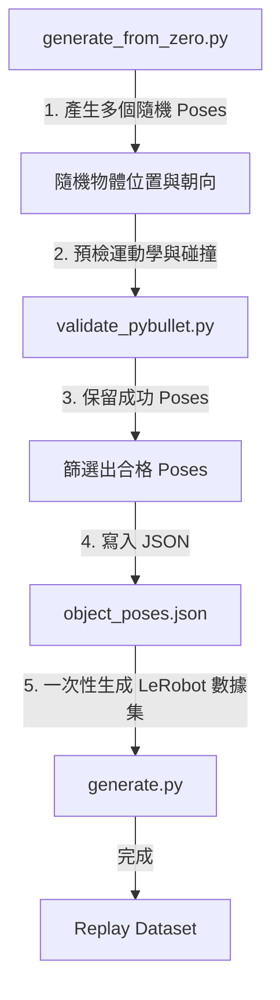

# 隨機程序化位姿生成、輕量化驗證與資料錄製指南 (Group 7)

本文件說明了我們為餐具擺放任務（`HCIS-CutleryArrangement-SingleArm-v0`）所實作的**隨機程序化位姿生成方案與驗證腳本**。

---

## 📌 TL;DR (太長不看版)
* **隨機生成符合 UMI 格式的 Poses**：使用 `generate_from_zero.py` 在桌面上隨機撒點產生餐具初始位姿，不再強綁人類 SLAM 影片，全自動且高效率。
* **CPU 端一秒過濾，不吃 Isaac 模擬點數**：利用 PyBullet CPU 物理模擬快速執行手臂運動學（IK）與碰撞預演，將不合理的位姿在進入 Isaac Sim 渲染前直接剔除。
* **對齊狀態機局部坐標抓取偏移 (Local Frame Translation)**：捨棄舊版朝基座方向拉回的偏心抓取，改為依據刀叉自身的旋轉角度（Yaw），沿長軸向手柄方向精準偏移 `2.5 cm`。無論餐具如何旋轉，夾爪都能穩穩抓住手柄相同幾何位置。
* **解決下放穿透與反彈物理錯誤**：對齊 Isaac Sim 與 PyBullet 的下放高度幾何定義。夾爪在釋放刀叉時，手指與餐具底端會懸空於桌面表層上方約 `1.5 cm` 處開夾釋放，完全消除了刀叉被壓入桌面後反彈飛起的 Bug。
* **統一資料生成入口**：舊的 `generate_procedural.py` 與 `procedural_cutlery.py` 樣條狀態機已全數廢棄刪除。整個隨機程序化生成管線完全收斂至「`generate_from_zero.py` 產生 Poses $\rightarrow$ `generate.py` 模擬重播錄製」的主管線中，代碼更加乾淨。

---

## 一、 主要設計與架構

我們架構的核心目標是**「高度解耦、流程統一、CPU 預篩選」**：



### 1. 程序化隨機位姿生成器 (`scripts/datagen/generate_from_zero.py`)
* **Spawning 區間隨機化**：隨機在檯面合理範圍生成刀叉初始座標與朝向角。
* **局部座標平移抓取偏移 (Grasp Offset)**：
  * **叉子 (Fork)**：STL/USD 尖端朝向局部 $+Z$，手柄朝向 $-Z$。手臂抓取點往 $-Z$ 偏移 `2.5 cm`，自動夾在手柄側。
  * **刀子 (Knife)**：STL/USD 尖端朝向局部 $-Z$，手柄朝向 $+Z$。手臂抓取點往 $+Z$ 偏移 `2.5 cm`，自動夾在手柄側。
* **調用 PyBullet 預檢**：生成過程中直接導入 `PyBulletFrankaValidator` 驗證，只將物理上安全、IK 能解的有效位姿寫入 `object_poses.json`。

### 2. CPU 輕量化快速碰撞驗證器 (`scripts/datagen/validate_pybullet.py`)
* **輕量 URDF 模擬**：載入 Franka URDF 手臂模型，並將餐具與盤子用包圍體（Mesh / Cylinder）表示，透過 CPU 執行快速的軌跡碰撞攔截。
* **釋放高度對齊**：`_Z_RELEASE` 常數更新為 `_TABLE_HEIGHT + 0.10`（約 $14\text{ cm}$ 腕部高度），確保 PyBullet 驗證的落點高度與 Isaac Sim 的釋放高度一致，杜絕桌面穿透檢測死角。
* **抓取偏移對齊**：同樣將抓取偏移改為沿著物件的局部 Y 軸（對齊 `q_align` 旋轉後的 STL 長軸）平移 `2.5 cm`，保持與狀態機一模一樣的幾何路徑。

### 3. 主重播生成程式 (`scripts/datagen/generate.py`)
* 依賴讀取生成的 `object_poses.json`，在 Isaac Sim 中控制 Franka 手臂完成抓取流程，並使用 `LeRobotRecorderManager` 錄製生成 LeRobot 格式訓練數據集。

---

## 二、 執行指令與操作說明

### 1. 產生並預過濾程序化位姿 JSON (generate_from_zero.py)
* **建議生成數量**：建議設定 `--num_demos 100` 或 `200` 個。
* **理由**：LeRobot 策略模型（如 Diffusion Policy）需要約 100 到 200 個成功的 Episodes 以達到穩定的操控表現。

```bash
# 執行生成指令，產生 100 個完全通過運動學與碰撞驗證的 spawn 點 JSON
# (可在主機的 .venv 中，或是 Isaac Lab 的 Docker 容器內執行)
python scripts/datagen/generate_from_zero.py \
    --num_demos 100 \
    --output data/procedural_spawn/demos/mapping/object_poses.json
```
如果需要在本地開啟 GUI 視窗，詳細觀看 PyBullet 的碰撞與軌跡過濾過程：
```bash
python scripts/datagen/generate_from_zero.py \
    --num_demos 100 \
    --output data/procedural_spawn/demos/mapping/object_poses.json \
    --gui
```

### 2. 在 Isaac Sim 中執行重播與 LeRobot 錄製
啟動 Isaac Lab 容器後（以 glows.ai 4090 顯卡為例）：
```bash
# 1. 進入容器
make launch-isaaclab-glowsai-4090

# 2. 在容器內執行錄製程式，載入剛產生的 JSON 並加上渲染加速 flag
python scripts/datagen/generate.py \
    --task HCIS-CutleryArrangement-SingleArm-v0 \
    --num_envs 1 \
    --device cuda \
    --enable_cameras \
    --record \
    --use_lerobot_recorder \
    --lerobot_dataset_repo_id XiaoPanPanKevinPan/aicapstone_group7_cutlery_v2_replay \
    --object_poses data/procedural_spawn/demos/mapping/object_poses.json \
    --rendering_mode performance
```

---

## 三、 驗證人類操作影片位姿
本專案的驗證腳本（`validate_pybullet.py`）亦可用來過濾人類真實操作影片所重建的初始位姿：
```bash
# 驗證真實人類示範的 JSON，篩選出物理上可行、不撞擊且 IK 能解的 Episode
python scripts/datagen/validate_pybullet.py \
    --object_poses data/AI-final-49/demos/mapping/object_poses.json
```

---

## 四、 合併多個 object_poses.json 檔案的方法

根據你的數據來源（是實體人類影片重建的 Session 目錄，還是純 JSON 位姿設定檔），我們提供以下幾種合併方式：

### 方法一：合併實體錄影的多個 Sessions (UMI 內建工具，推薦用於實體示範)
如果您有複數個獨立錄影的 Session 目錄（例如分別位於 `data/AI-final-49_session1` 與 `data/AI-final-49_session2`），其內部各自有 SLAM 重建出來的 `object_poses.json`。可以使用專案內建的 `merge-object-poses` 工具將這幾個 **Session 目錄** 直接進行物理合併：

```bash
# 語法：uv run umi merge-object-poses <session_1> <session_2> ... -o <output_session>
# 合併後，產出的合併位姿 json 會位於 data/AI-final-49_merged/demos/mapping/object_poses.json
uv run umi merge-object-poses data/AI-final-49_session1 data/AI-final-49_session2 -o data/AI-final-49_merged
```
* **特點**：這適用於 UMI 實體人手示範影片所產生的數據結構合併，它會一併整理 Session 的影像軌跡與相對應的 poses 檔。

### 方法二：直接合併純 JSON 檔案（自動解決命名衝突，推薦用於程序化/隨機 Poses）
如果是多個已生成好的 `object_poses.json` 檔案（例如您分別跑了幾次隨機程序化生成得到的 outputs），需要直接把 JSON 裡的 episodes 合併，但又擔心 `video_name` 重名（例如兩個 JSON 內都有 `episode_0`）會導致重播錄製時資料被覆蓋，我們實作了 [merge_poses.py](file:///media/user/ext4Storage/癢又ㄉ/Syncing/大學/大三下/AiCapstone/course-project/scripts/datagen/merge_poses.py) 來安全地合併多個 JSON 檔：

```bash
# 執行合併腳本，傳入多個輸入 JSON，並輸出合併後的 JSON
python scripts/datagen/merge_poses.py \
    --inputs data/procedural_spawn/demos/mapping/object_poses.json data/AI-final-49/demos/mapping/object_poses.json \
    --output data/merged_object_poses.json
```
* **特點**：若偵測到重名的 `video_name`，腳本會自動為重名者加上 `_dup1`、`_dup2` 等後綴，安全無衝突。

### 方法三：使用 Python 一行指令快速合併（無衝突且純 JSON 時適用）
若確定兩份 JSON 的 `video_name` 完全沒有重複，亦可在終端機中使用 Python 一行命令直接將其相加：
```bash
python -c "import json; open('data/merged_object_poses.json', 'w').write(json.dumps(json.load(open('data/procedural_spawn/demos/mapping/object_poses.json')) + json.load(open('data/AI-final-49/demos/mapping/object_poses.json')), indent=4))"
```

---

## 五、 餐具擺放狀態機 8 階段對照表

在重構與時間常數對齊後，機械手臂在整理每件餐具（先刀後叉）時會依序執行以下 8 個 Phase：

| Phase 編號 | 階段名稱 (Name) | 執行步數 (Durations) | 超時上限 (Timeouts) | 控制模式 (Control Mode) | 夾爪狀態 (Gripper) | 旋轉對齊 (Rotation) | 動作細節描述 (Detailed Description) |
| :---: | :--- | :---: | :---: | :---: | :---: | :---: | :--- |
| **0** | **Move above object (Hover)**<br>移動至物體上方懸停 | `270` | `405` | 閉環對齊 | 張開 | 無 | 手臂從起始位置移至物件初始中心上方 `15 cm` 的位置，夾爪向下並初步轉動對齊物件偏航角。 |
| **1** | **Approach down to object**<br>下降接近物件 | `130` | `195` | 閉環對齊 | 張開 | 無 | 夾爪垂直降到物件上方 `8 cm` (`_GRASP_Z_OFFSET`)，將指爪套入物件夾取點。 |
| **2** | **Close gripper to grasp**<br>閉合夾爪進行抓取 | `20` | `20` | 開環計時 | 閉合中 | 無 | 手臂保持不動，夾爪向內閉合，為純時間控制（等待 20 步以確實夾緊）。 |
| **3** | **Lift object upward**<br>抬升物件 | `160` | `240` | 閉環對齊 | 閉合 | 無 | 手臂垂直抬升物件至 `22 cm` 的高度 (`_LIFT_Z_OFFSET` 已被修正為 22 cm)，脫離桌面摩擦。 |
| **4** | **Move above target position**<br>移動至放置點上方 | `255` | `382` | 閉環對齊 | 閉合 | **有（Yaw 插值）** | 手臂橫移至盤子旁的放置點上方（維持 `22 cm` 高度），**同時在移動中漸進式地將手腕 Yaw 角旋轉對齊最終擺放方向**。 |
| **5** | **Lower to release**<br>下降至擺放高度 | `15` | `22` | 閉環對齊 | 閉合 | 無 | 手臂垂直下降至離桌面 `9 cm` 高度 (`_RELEASE_Z_OFFSET`)，準備釋放物件（位置對齊後即進入下一階段）。 |
| **6** | **Open gripper to release**<br>原地開爪釋放物件 | `25` | `25` | 開環計時 | 張開中 | 無 | 手臂在放手高度保持完全靜止，夾爪向外張開釋放物件（等待 25 步讓物件平穩落地，避免拉扯）。 |
| **7** | **Retreat upward**<br>升起撤退 | `30` | `45` | 閉環對齊 | 張開 | 無 | 空夾爪垂直升起至 `22 cm` 高度，避免橫向橫掃時撞倒已放置好的刀叉，隨後切換至下一個物件。 |

* **控制模式說明**：
  * **閉環對齊**：手臂會利用 `check_arrival` 實時監測機械手臂是否已到達目標位置與角度（位置誤差 $\le 3.0$ cm，角度誤差 $\le 5.73^\circ$），一旦到達就會提早跳轉下一階段；若未在「超時上限」前到達則會記錄 timeout 診斷訊息並強制進入下一階段。
  * **開環計時**：夾爪的物理開合是時間驅動的，因此程式碼會固定跑滿「執行步數」以確保物理效果完成。

---

## 六、 generate.py 與 validate_pybullet.py 早期終止 (Early Stage Termination) 機制對照表

在數據生成主程式與 PyBullet 預篩選腳本中，針對失敗或異常的 Episode 有不同的早期終止與過濾機制：

| 終止與過濾條件 | `generate.py` (Isaac Sim 模擬/錄製主程式) | `validate_pybullet.py` (PyBullet CPU 預檢腳本) |
| :--- | :--- | :--- |
| **夾取失敗判定**<br>*(Grasp Failure)* | **有早期中斷**<br>在 Lift 階段結束時（即 Event 3 或 11），會檢查刀叉的 Z 軸高度是否低於 `0.08 m`。若未成功提起，視為夾取失敗，**立即中斷並跳過此 Episode**。 | **無中斷 (物理上強制夾住)**<br>使用 PyBullet 的 `p.createConstraint(..., p.JOINT_FIXED)` 強行將刀叉固定在夾爪上進行運動學仿真，故無滑落問題。 |
| **物體掉落判定**<br>*(Object Fall)* | **全程持續偵測**<br>在整個模擬期間，隨時監測桌上所有任務物件的 Z 軸高度。一旦任何物件低於桌子（跌落），**立即中斷並跳至下一個 Pose**。 | **僅初始化階段偵測**<br>僅在初始放置 settling 階段 (前 100 步) 檢查刀叉 Z 軸是否低於 `_TABLE_SURFACE_Z - 0.01`。一旦掉落就回傳 `False` 中斷，後續運動過程則不重複偵測。 |
| **碰撞偵測判定**<br>*(Collision)* | **不會因為碰撞中斷**<br>允許手臂在運作中與桌子、盤子或刀叉產生摩擦碰撞（只要不把東西撞落桌子），模擬會持續進行，最後才透過位置檢查成功與否。 | **瞬間中斷**<br>在路徑插補的每一步，都會呼叫 `performCollisionDetection()`。一旦偵測到**非預期碰撞**（如自我碰撞、物件碰撞、手臂撞桌子），**立即回傳 `False` 判定此 Pose 失敗**。 |
| **超時限制判定**<br>*(Timeout)* | **狀態機與 Episode 總步數限制**<br>當各 Phase 到達我們設定的閉環最大步數超時限制（例如 Movement 1.5 倍，下降 22 步）時會跳過並印出診斷 Log。此外，若總步數超過 `MAX_STEPS` 亦會中斷。 | **路徑節點數限制**<br>插補軌跡以固定的 Segment Steps (如 30 或 40 步) 走完。如果在這些步數內 IK 找不到解，或者是關節限位導致自我碰撞，會直接被碰撞檢測觸發 Fail。 |

---

## 七、 狀態機設計演變與常數歷史說明 (History & Rationale)

為方便後續維護，以下記錄狀態機中常數設計的由來，以及從助教範本（Template）演進到全新 8 階段狀態機的關鍵原因。

### 1. 時間因子與常數的設計意圖
* `_STEP_SCALE_FACTOR` (一般化 scaling，值為 `1.0`)：
  * 相乘於 `_PHASE_DURATIONS_PER_OBJECT` 上，作為基準時間的縮放比例。
* `_MAX_STEP_SCALE_FACTOR` (超時上限倍率，值為 `1.5`)：
  * 用於計算各閉環對齊 Phase 的 `max_steps` 超時上限。例如基準步數為 270 步，超時上限即為 $270 \times 1.5 = 405$ 步。超過此步數若仍未到達 tolerance，將強制進入下一 Phase 並輸出診斷 Log。
* `_MIN_STEP_SCALE_FACTOR` (最低執行步數倍率，值為 `0.1`)：
  * 用於計算各對齊 Phase 的 `min_steps`。例如基準 270 步，最低需走滿 $270 \times 0.1 = 27$ 步。此設計是為了避免手臂在上一階段剛結束、新目標尚未更新的瞬間，因上一格暫態誤差極小而誤判定「已到達」進而發生跳關的情形。

### 2. 關於 `_PHASE_DURATIONS_PER_OBJECT` 的使用位置
* 此 Tuple 定義了每個物體生命週期內 8 個 Phase 的**基準持續時間**。
* 在狀態機初始化時被讀入 `self._events_dt`：
  ```python
  self._events_dt: list[int] = list(_PHASE_DURATIONS_PER_OBJECT) * len(_PICK_ORDER)
  ```
  用來決定每一個 Event 的 `default_duration`，進而做為閉環 `min_steps` 與 `max_steps` 的計算基準。

### 3. 範本與 Phase 5/6/7 設計演變歷史
* **助教原始範本（Template，Commit `f84d85e`）**：
  * **原設計為 7 個 Phase**（對照疊杯任務 `cup_stacking.py`）。
  * 當時的 Phase 5 是「下放至擺放高度（Lower to release）」，期間夾爪保持**閉合**。
  * 當時的 Phase 6 是「撤退（Retreat upward）」，期間夾爪**張開**。
  * **助教將開爪與撤退混在一起的動機**：在杯子任務中，杯子底面積大且重，手臂一邊向上抬起一邊開爪，杯子會因重力自然留在桌上。這樣能省去原地開夾的步數，使動作更連貫。
* **刀叉任務中的摩擦力問題**：
  * 當此 7 階段範本直接套用在刀叉上時，因為刀叉極輕且薄，夾爪側面摩擦力很大。當手臂一邊抬起一邊開爪，**手指會直接把刀叉扯飛或使其在空中翻轉**，導致極高的失敗率。
* **第一階段修復（XPPKP Commit `c6d1199`）**：
  * 為了防止扯飛，將原本的 Phase 5 在程式碼內部拆成了兩個「子階段」：前 15 步做閉爪下降，後 25 步做原地開爪釋放。
  * 這雖然解決了物理上的扯飛問題，但導致程式碼結構不乾淨（Phase 5 隱藏了兩種截然不同的動作與控制邏輯，且 `_events_dt` 難以對齊）。
* **最終 8 階段重構（確保程式整潔性）**：
  * 我們正式將隱藏的子階段抽離，重構成乾淨的 **8 階段狀態機**：
    * **Phase 5 (Lower to release)**：垂直下放至擺放高度，夾爪保持閉合（運動結束即切換）。
    * **Phase 6 (Open gripper to release)**：原地保持完全靜止，夾爪張開釋放（開環計時 25 步，讓物件完全平穩）。
    * **Phase 7 (Retreat upward)**：空夾爪垂直升起至安全高度（Z = 22 cm），避免橫向橫掃時撞翻已擺好的餐具。

