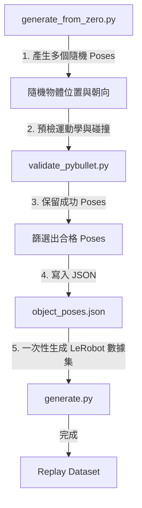

# 隨機程序化位姿生成、輕量化驗證與資料錄製指南 (Group 7)

本文件說明了我們為餐具擺放任務（`HCIS-CutleryArrangement-SingleArm-v0`）所實作的**隨機程序化位姿生成方案與驗證腳本**。

---

## 📌 TL;DR (太長不看版)
* **隨機生成符合 UMI 格式的 Poses**：使用 `generate_from_zero.py` 在桌面上隨機撒點產生餐具初始位姿，不再強綁人類 SLAM 影片，全自動且高效率。
* **CPU 端一秒過濾，不吃 Isaac 模擬點數**：利用 PyBullet CPU 物理模擬快速執行手臂運動學（IK）與碰撞預演，將不合理的位姿在進入 Isaac Sim 渲染前直接剔除。
* **對齊狀態機局部坐標抓取偏移 (Local Frame Translation)**：捨棄舊版朝基座方向拉回的偏心抓取，改為依據刀叉自身的旋轉角度（Yaw），沿長軸向手柄方向精準偏移 `2.5 cm`。無論餐具如何旋轉，夾爪都能穩穩抓住手柄相同幾何位置。
* **解決下放穿透與反彈物理錯誤**：對齊 Isaac Sim 與 PyBullet 的下放高度幾何定義。夾爪在釋放刀叉時，手指與餐具底端會懸空於桌面表層上方約 `1.5 cm` 處開夾釋放，完全消除了刀叉被壓入桌面後反彈飛起的 Bug。
* **統一資料生成入口**：舊的 `generate_procedural.py` 與 `procedural_cutlery.py` 樣條狀態機已全數廢棄刪除。整個隨機程序化生成管線完全收斂至「`generate_from_zero.py` 產生 Poses $\rightarrow$ `generate.py` 模擬重播錄製」的主管線中，代碼更加乾淨。

---

## 一、 主要設計與架構

我們架構的核心目標是**「高度解耦、流程統一、CPU 預篩選」**：



### 1. 程序化隨機位姿生成器 (`scripts/datagen/generate_from_zero.py`)
* **Spawning 區間隨機化**：隨機在檯面合理範圍生成刀叉初始座標與朝向角。
* **局部座標平移抓取偏移 (Grasp Offset)**：
  * **叉子 (Fork)**：STL/USD 尖端朝向局部 $+Z$，手柄朝向 $-Z$。手臂抓取點往 $-Z$ 偏移 `2.5 cm`，自動夾在手柄側。
  * **刀子 (Knife)**：STL/USD 尖端朝向局部 $-Z$，手柄朝向 $+Z$。手臂抓取點往 $+Z$ 偏移 `2.5 cm`，自動夾在手柄側。
* **調用 PyBullet 預檢**：生成過程中直接導入 `PyBulletFrankaValidator` 驗證，只將物理上安全、IK 能解的有效位姿寫入 `object_poses.json`。

### 2. CPU 輕量化快速碰撞驗證器 (`scripts/datagen/validate_pybullet.py`)
* **輕量 URDF 模擬**：載入 Franka URDF 手臂模型，並將餐具與盤子用包圍體（Mesh / Cylinder）表示，透過 CPU 執行快速的軌跡碰撞攔截。
* **釋放高度對齊**：`_Z_RELEASE` 常數更新為 `_TABLE_HEIGHT + 0.10`（約 $14\text{ cm}$ 腕部高度），確保 PyBullet 驗證的落點高度與 Isaac Sim 的釋放高度一致，杜絕桌面穿透檢測死角。
* **抓取偏移對齊**：同樣將抓取偏移改為沿著物件的局部 Y 軸（對齊 `q_align` 旋轉後的 STL 長軸）平移 `2.5 cm`，保持與狀態機一模一樣的幾何路徑。

### 3. 主重播生成程式 (`scripts/datagen/generate.py`)
* 依賴讀取生成的 `object_poses.json`，在 Isaac Sim 中控制 Franka 手臂完成抓取流程，並使用 `LeRobotRecorderManager` 錄製生成 LeRobot 格式訓練數據集。

---

## 二、 執行指令與操作說明

### 1. 產生並預過濾程序化位姿 JSON (generate_from_zero.py)
* **建議生成數量**：建議設定 `--num_demos 100` 或 `200` 個。
* **理由**：LeRobot 策略模型（如 Diffusion Policy）需要約 100 到 200 個成功的 Episodes 以達到穩定的操控表現。

```bash
# 執行生成指令，產生 100 個完全通過運動學與碰撞驗證的 spawn 點 JSON
# (可在主機的 .venv 中，或是 Isaac Lab 的 Docker 容器內執行)
python scripts/datagen/generate_from_zero.py \
    --num_demos 100 \
    --output data/procedural_spawn/demos/mapping/object_poses.json
```
如果需要在本地開啟 GUI 視窗，詳細觀看 PyBullet 的碰撞與軌跡過濾過程：
```bash
python scripts/datagen/generate_from_zero.py \
    --num_demos 100 \
    --output data/procedural_spawn/demos/mapping/object_poses.json \
    --gui
```

### 2. 在 Isaac Sim 中執行重播與 LeRobot 錄製
啟動 Isaac Lab 容器後（以 glows.ai 4090 顯卡為例）：
```bash
# 1. 進入容器
make launch-isaaclab-glowsai-4090

# 2. 在容器內執行錄製程式，載入剛產生的 JSON 並加上渲染加速 flag
python scripts/datagen/generate.py \
    --task HCIS-CutleryArrangement-SingleArm-v0 \
    --num_envs 1 \
    --device cuda \
    --enable_cameras \
    --record \
    --use_lerobot_recorder \
    --lerobot_dataset_repo_id XiaoPanPanKevinPan/aicapstone_group7_cutlery_v2_replay \
    --object_poses data/procedural_spawn/demos/mapping/object_poses.json \
    --rendering_mode performance
```

---

## 三、 驗證人類操作影片位姿
本專案的驗證腳本（`validate_pybullet.py`）亦可用來過濾人類真實操作影片所重建的初始位姿：
```bash
# 驗證真實人類示範的 JSON，篩選出物理上可行、不撞擊且 IK 能解的 Episode
python scripts/datagen/validate_pybullet.py \
    --object_poses data/AI-final-49/demos/mapping/object_poses.json
```
